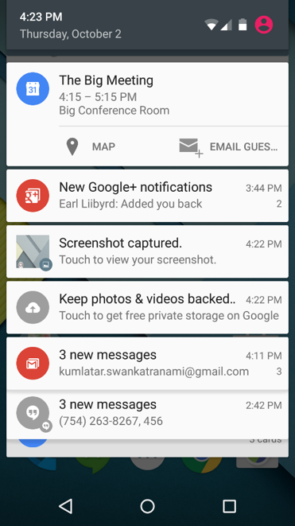
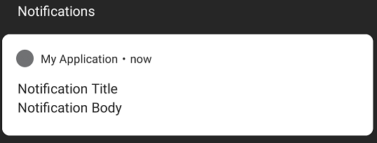
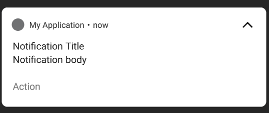
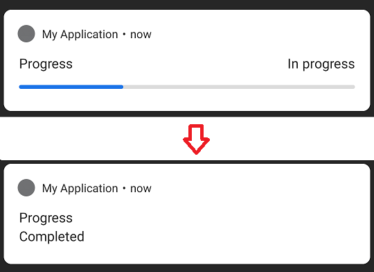
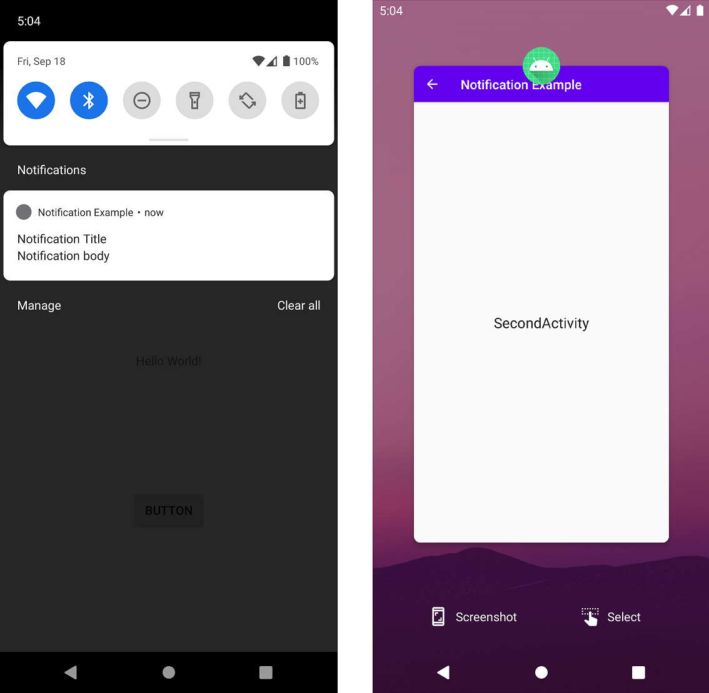
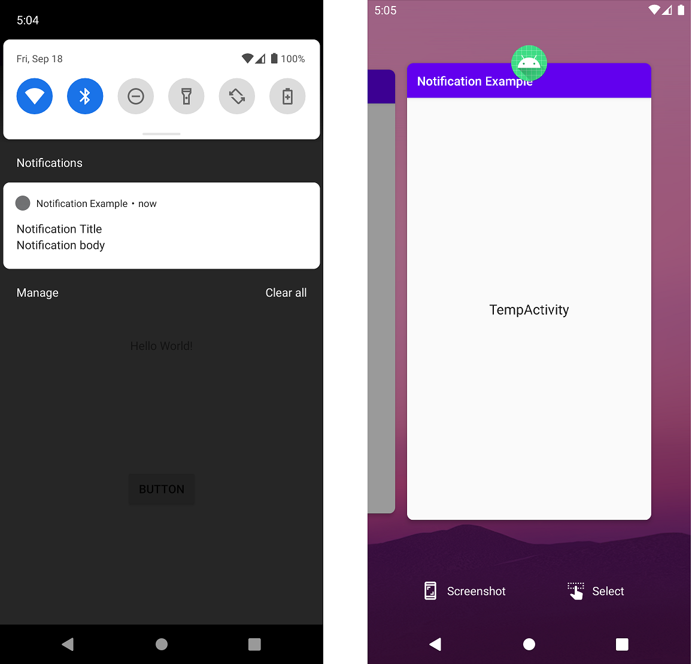

# 알림(Notification)
<!-- _class: lead -->
### 허준영(jyheo@hansung.ac.kr)

## 알림(Notification) 개요
- 앱의 UI와 별도로 사용자에게 앱과 관련한 정보를 보여주는 기능
- 알림을 터치하여 해당 앱을 열거나, 
    - 바로 간단한 작업(예: 문자 답하기)을 할 수 있음(Android 7.0부터)
- 보통 단말기 상단 부분에 표시되고,
    - 앱 아이콘의 배지로도 표시(Android 8.0부터)
 


## NotificationCompat
- 알림은 안드로이드가 버전에 따라 기능이 계속 추가되어 왔음
    - 여기에서는 안드로이드 8.0이상을 기준으로 이야기 하지만
    - 이전 버전에서도 동작할 수 있도록 support library의 NotificationCompat, NotificationManagerCompat 사용이 권장됨
- 이미 support library를 사용하고 있으면 별로도 gradle 수정할 필요 없음
    - ``` implementation 'androidx.appcompat:appcompat:1.2.0' ```


## 알림 채널(Android 8.0 이상)
- Android 8.0 이상의 경우는 알림을 만들기 전에 알림 채널을 먼저 만들어야 함
- 알림 채널은 알림을 그룹하여 알림 활성화나 방식을 변경할 수 있음
- 현재 앱이 실행 중인 안드로이드 버전을 확인하여 8.0 이상인 경우만 채널 생성
    - ``` Build.VERSION.SDK_INT >= Build.VERSION_CODES.O ```
    ```kotlin
    private val myNotificationID = 1
    private val channelID = "default"

    private fun createNotificationChannel() {
        if (Build.VERSION.SDK_INT >= Build.VERSION_CODES.O) { // Android 8.0
            val channel = NotificationChannel(channelID, "default channel",
                NotificationManager.IMPORTANCE_DEFAULT)
            channel.description = "description text of this channel."
            val notificationManager = getSystemService(Context.NOTIFICATION_SERVICE) as NotificationManager
            notificationManager.createNotificationChannel(channel)
        }
    }
    ```

## 알림 생성
* NotificationCompat.Builder 객체에서 알림에 대한 UI 정보와 작업을 지정
    - setSmallIcon(): 작은 아이콘
    - setContentTitle(): 제목
    - setContentText(): 세부 텍스트
* NotificationCompat.Builder.build() 호출
    - Notification 객체를 반환
* NotificationManagerCompat.notify()를 호출해서 시스템에 Notification 객체를 전달

## 단순 알림 생성
- 단순 알림 생성, notify()
    ```kotlin
    private val myNotificationID = 1

    private fun showNotification() {
        val builder = NotificationCompat.Builder(this, channelID)
            .setSmallIcon(R.mipmap.ic_launcher)
            .setContentTitle("title")
            .setContentText("notification text")
            .setPriority(NotificationCompat.PRIORITY_DEFAULT)
        NotificationManagerCompat.from(this).notify(myNotificationID, builder.build())
    }
    ```
    - myNotificationID 값을 다르게 주고 notify()를 호출하면 알림이 또 표시됨
    


## 알림 중요도
- 채널 중요도(Android 8.0 이상)
    ```kotlin
    NotificationChannel(channelID, "default channel", NotificationManager.IMPORTANCE_DEFAULT) 
    ```
- 알림 우선순위(Android 7.1 이하)
    ```kotlin
    NotificationCompat.Builder(this, channelID).setPriority(NotificationCompat.PRIORITY_DEFAULT)
    ```
- 채널/알림 중요도/우선순위 수준
    |중요도 | 설명    | 중요도(Android 8.0 이상)      | 우선순위(Android 7.1 이하) |
    |-------|---------|----------------------|----------------------------|
    | 긴급  | 알림음이 울림, 헤드업 알림 표시 | IMPORTANCE_HIGH | PRIORITY_HIGH |
    | 높음  | 알림음이 울림                 | IMPORTANCE_DEFAULT | PRIORITY_DEFAULT |
    | 중간  | 알림음이 없음                 | IMPORTANCE_LOW | PRIORITY_LOW |
    | 낮음  | 알림음이 없음, 상태 표시줄에 표시 안됨|IMPORTANCE_MIN | PRIORITY_MIN |


## 알림에 확장 뷰
- 긴 텍스트를 추가한 확장 뷰를 알림에 넣을 수 있음
    ```kotlin
    builder.setStyle(NotificationCompat.BigTextStyle()
                    .bigText(resources.getString(R.string.long_notification_body)))
    ```
    


## 알림에 확장 뷰
- 그림 넣은 확장 뷰
    ```kotlin
    val bitmap = BitmapFactory.decodeResource(resources, R.drawable.android_hsu)
    val builder = NotificationCompat.Builder(this, channelID)
        .setSmallIcon(R.mipmap.ic_launcher)
        .setLargeIcon(bitmap)
        .setContentTitle("Notification Title")
        .setContentText("Notification body")
        .setPriority(NotificationCompat.PRIORITY_DEFAULT)
        .setStyle(NotificationCompat.BigPictureStyle()
            .bigPicture(bitmap)
            .bigLargeIcon(null))  // hide largeIcon while expanding
    ```
    


## 알림에 버튼 추가
- 알림에 버튼을 추가하고 버튼을 누르면 Intent로 Activity나 Broadcast를 시작함
    - Action 버튼을 누르면 TestActivity가 시작됨
    ```kotlin
    val intent = Intent(this, TestActivity::class.java)
    val pendingIntent = PendingIntent.getActivity(this, 0, intent, 0)
    val builder = NotificationCompat.Builder(this, channelID)
        .setSmallIcon(R.mipmap.ic_launcher)
        .setContentTitle("Notification Title")
        .setContentText("Notification body")
        .setPriority(NotificationCompat.PRIORITY_DEFAULT)
        .addAction(R.drawable.android_hsu, "Action", pendingIntent)
    NotificationManagerCompat.from(this).notify(myNotificationID, builder.build())
    ```
    


## 알림에 프로그래스 표시
- 알림에 프로그래스 바를 표시
    ```kotlin
    val builder = NotificationCompat.Builder(this, channelID)
        .setSmallIcon(R.mipmap.ic_launcher)
        .setContentTitle("Progress")
        .setContentText("In progress")
        .setProgress(100, 0, false)
        .setPriority(NotificationCompat.PRIORITY_DEFAULT)
    NotificationManagerCompat.from(this).notify(myNotificationID, builder.build())

    Thread {  // 스레드로 프로그래스바 업데이트
        for (i in (1..100).step(10)) {
            Thread.sleep(1000)
            builder.setProgress(100, i, false)
            NotificationManagerCompat.from(this)\
                .notify(myNotificationID, builder.build())
        }
        builder.setContentText("Completed")
            .setProgress(0, 0, false)    // max=0이면 프로그래스바 사라짐
        NotificationManagerCompat.from(this)
            .notify(myNotificationID, builder.build())  // 같은 ID로 notify
    }.start()
    ```




## 알림에 액티비티 연결하기
* 알림을 터치하면 연결된 액티비티가 실행되도록 하는 것
    - PendingIntent 사용
    - 연결된 액티비티가 일반 액티비티, 알림 전용 액티비티인지에 따라 백스택 관리가 달라짐
* 일반 액티비티: 일반적인 앱의 액티비티임
    - 사용자가 앱을 사용하면서 액티비티를 시작시키는 것과 유사하게 백스택을 관리
* 알림 전용 액티비티: 알림하고만 연결되어 실행 가능한 액티비티로 알림을 확장 하는 개념
    - 사용자가 다른 방법으로 시작하지는 못하게 함


## 태스크와 백 스택(Back Stack)
- 태스크(Task): 어떤 작업을 하기 위한 액티비티의 그룹
    - 태스크마다 자신의 백스택을 가지고 있음
    
    - foreground, background task
    
        - foreground task(Task B), background task(Task A)
        - 최근 앱 보기에서 선택하거나 앱 아이콘을 눌러서 foreground task로 전환할 수 있음

<!-- 
예) 이메일 목록 보여주는 액티비티에서 메일을 선택했을 때 상세보기 액티비티를 시작한다고 하면, 이 두 액티비티는 하나의 태스크로 관리됨
-->

## 태스크와 백 스택(Back Stack)
- 액티비티를 시작(startActivity)할 때 플래그에 따라 다르게 동작하게 할 수 있음
    - A라는 액티비티를 시작한다고 가정, startActivity(A)
    - 플래그 없음: 액티비티 A의 새 인스턴스를 항상 시작함
    - FLAG_ACTIVITY_NEW_TASK: 새 태스크로 A를 시작, 하지만 이미 실행 중인 A의 인스턴스가 있다면 새로 만들지 않고 A의 인스턴스가 포함된 태스크를 앞(foreground)으로 가져오고 A의 onNewIntent()호출
        - FLAG_ACTIVITY_CLEAR_TASK: A의 인스턴스와 관련된 모든 기존 태스크를 제거하고 새로 A의 인스턴스를 시작함, FLAG_ACTIVITY_NEW_TASK와 같이 사용해야 함
    - FLAG_ACTIVITY_SINGLE_TOP: A의 인스턴스가 태스크 백스택 탑에 존재하는 경우, 새로 만들지 않고 A의 onNewIntent() 호출 
    - FLAG_ACTIVITY_CLEAR_TOP: A의 인스턴스가 이미 시작 중인 경우 백스택에서 A의 인스턴스 위에 있는 다른 액티비티 인스턴스들을 모두 제거하고 A의 onNewIntent() 호출
        - FLAG_ACTIVITY_NEW_TASK와 같이 자주 사용됨


## 태스크와 백 스택(Back Stack)
- 플래그 FLAG_ACTIVITY_NEW_TASK 예

- https://developer.android.com/guide/components/activities/tasks-and-back-stack


## 알림에 액티비티 연결하기 - 일반 액티비티
* 알림을 터치하면 일반 액티비티인 SecondActivity가 시작, 이때 MainActivity위에 SecondActivity가 있는 백스택을 생성
* AndroidManifest.xml의 SecondActivity 정의 부분
    ```xml
    <activity android:name=".SecondActivity"  android:parentActivityName=".MainActivity" />
    ```
* PendingIntent 생성하고 알림 등록
    ```kotlin
    val intent = Intent(this, SecondActivity::class.java)
    val pendingIntent = with (TaskStackBuilder.create(this)) {
        addNextIntentWithParentStack(intent)
        getPendingIntent(0, PendingIntent.FLAG_UPDATE_CURRENT)
    }
    val builder = NotificationCompat.Builder(this, channelID)
        .setSmallIcon(R.mipmap.ic_launcher)
        .setContentTitle("Notification Title")
        .setContentText("Notification body")
        .setPriority(NotificationCompat.PRIORITY_DEFAULT)
        .setContentIntent(pendingIntent)
        .setAutoCancel(true) // auto remove this notification when user touches it
    NotificationManagerCompat.from(this).notify(myNotificationID, builder.build())                          
    ```

## 알림에 액티비티 연결하기 - 일반 액티비티
- 알림을 터치하면
    - 알림은 사라지고, SecondActivity가 실행됨
    - SecondActivity가 실행된 상태에서 Back이나 Up을 누르면 MainActivity가 나옴.
        - 사실 MainActivity가 이미 백스택에 있기 때문에 TaskStackBuilder로 백스택을 조작하지 않아도 동일하게 동작
        - 백스택에 없는 다른 액티비티를 SecondActivity의 parentActivity로 하면 달라짐



## 알림에 액티비티 연결하기 - 알림 전용 액티비티
- 알림을 터치하면 알림 전용 액티비티인 TempActivity가 시작됨
- AndroidManifest.xml의 TempActivity 정의 부분
    ```xml
    <activity android:name=".TempActivity"
                android:taskAffinity=""
                android:excludeFromRecents="true"> </activity>
    ```
- PendingIntent 생성하고 알림 등록
    ```kotlin
    val intent = Intent(this, TempActivity::class.java)
    intent.flags = Intent.FLAG_ACTIVITY_NEW_TASK or Intent.FLAG_ACTIVITY_CLEAR_TASK
    val pendingIntent = PendingIntent.getActivity(this, 0, intent, PendingIntent.FLAG_UPDATE_CURRENT)
    val builder = NotificationCompat.Builder(this, channelID)
        .setSmallIcon(R.mipmap.ic_launcher)
        .setContentTitle("Notification Title")
        .setContentText("Notification body")
        .setPriority(NotificationCompat.PRIORITY_DEFAULT)
        .setContentIntent(pendingIntent)
        .setAutoCancel(true) // auto remove this notification when user touches it
    NotificationManagerCompat.from(this)
        .notify(myNotificationID, builder.build())
    ```

## 알림에 액티비티 연결하기 - 알림 전용 액티비티
- 알림을 터치하면,
    - 알림은 사라지고, TempActivity가 실행됨
    - 최근(Recents) 앱 보기를 눌러보면 TempActivity와 MainActivity가 서로 다른 태스크로 되어 있음
    - 알림을 터치하기 전에 홈 버튼을 누른 후에, 알림을 터치하여 TempActivity를 실행하게 한 후
        - TempActivity에서 Back을 누르면 백스택에 다른 액티비티가 없기 때문에 홈 화면으로 돌아감    



## 참고자료
- 예제코드
    - https://github.com/jyheo/android-kotlin-lecture/tree/master/examples/notification
- developer.android.com
    - https://developer.android.com/training/notify-user/build-notification


## 실습
- 아래의 요구사항을 만족하는 알림을 만든다.
- 요구사항
    - MainActivity, Noti1Activity, Noti2Activity
    - MainActivity에 메뉴를 만든다.
    - 메뉴 항목에는 알림1, 알림2
    - 알림1과 알림2는 서로 다른 알림 채널로 알림을 보낸다.
    - 알림1이 표시되고 터치하면 Noti2Activity를 시작하고, Back을 누르면 Noti1Activity가 나타난다. 한번 더 Back을 누르면 홈 화면이나 다른 태스크가 나타남
        - Noti12Activity의 parentActivity는 Noti1Activity임
    - 알림2는 표시만 되고 다른 동작을 할 필요는 없다.
- 제출
    - 소스코드.zip: MainActivity.kt, AndroidManifest.xml
    - 동영상: 예시 동영상 처럼 동작이 되도록 실습 결과를 녹화하여 제출한다.
